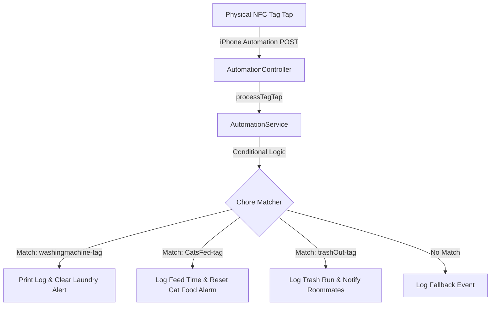

# 📡 Household Automation RFID Hub

A lightweight, robust Spring Boot service designed to bridge physical NFC/RFID tag events with local smart home actions. No more passive-aggressive fridge notes, no more chores forgotten. Just tap and let the system log it.

---

## 🎭 The Backstory: Surviving the Roommate Chore Wars

It started with a single sticky note on the microwave: *"Please clean your soup. - Management."* 

Then came the Great Laundry Stalemate of '25, where wet towels sat in the washing machine for three days like a damp, silent monument to roommate stubbornness. But the breaking point was the cats. Specifically, *Milo* and *Otis*. With three roommates on varying sleep schedules, the poor felines were either fed three times in a single morning (resulting in a couple of very fat, very happy cats) or not at all, leading to pre-dawn yowling and carpet scratching of apocalyptic proportions.

Trash duty? An exercise in structural physics, where garbage was piled up into a Jenga tower of milk cartons rather than anyone actually carrying it out to the bin.

Passive-aggression was at an all-time high. The Slack channel was a war zone. We needed a trustless, transparent, low-friction protocol for household chores. 

The solution? **Physical NFC Tags.**
We stuck NFC cards directly onto the washing machine, the cat food container, and the back door by the trash bins. Now, you don't send a text or write a note. You simply tap your phone against the physical card when you finish the chore. The event is fired instantly to our Spring Boot backend, logging the achievement, alerting the house, and keeping the peace.

---

## 🏗️ System Architecture

The workflow is simple: your client device (like an iPhone or esp32 scanner) detects a tag scan and pushes a POST request to our API endpoint.

---

## 🛠️ Tech Stack

* **Language**: Java 21 (OpenJDK)
* **Framework**: Spring Boot (v3.2.5)
* **Web Services**: Spring Web (MVC)
* **Data Layer**: Spring Data JPA with H2 (In-Memory Database)
* **Mobile Client**: iOS Personal Automations (Shortcuts)

---

## 🎨 Final UI Dashboard Preview

Once fully integrated with a frontend client, the hub exposes real-time scan metrics, device online statuses, and automation toggles:

---

## 🧠 How to Implement the Logic on Your Own

To write the core automation business logic without rewriting the entire framework, you will be coding inside the service layer implementation ([AutomationServiceImpl.java](file:///Users/hude/spring/rfid%20-system/src/main/java/com/house/automation/service/AutomationServiceImpl.java)). Here are the exact conceptual steps to implement the handler logic:

### 1. Data Extraction (Using Getters)
The method receives a [TagRequest](file:///Users/hude/spring/rfid%20-system/src/main/java/com/house/automation/model/TagRequest.java) object containing request parameters.
* Extract the unique identifier of the scanned tag (`tagId`) using the appropriate model getter.
* Extract the name/device of the person who scanned it (`scannedBy`) using the scanned-by model getter.

### 2. The Conditional Engine
Create a comparison branch using conditional blocks (`if-else` or `switch` statements):
* Compare the extracted `tagId` against your set of known physical card IDs (e.g. `"washingmachine-tag"`, `"trashOut-tag"`, or `"CatsFedandLittercleaned-tag"`).
* **Security & Cleanliness Tip**: Always use safe string comparison (`"known-tag-id".equals(tagId)`) to avoid null pointer exceptions in case the scanned tag ID is null.

### 3. Event Logging (Console & Diagnostics)
For each matched chore block:
* Construct a log message printing who swiped which tag (e.g. `[LOG] Roommate A swiped the WASHING MACHINE TAG!`).
* Use `System.out.println` or standard Spring logging (`org.slf4j.Logger`) to print the message.

### 4. Feedback Loop Resolution
* Return a clear, human-readable confirmation string (e.g. `"Good job keeping up with the laundry, Roommate A!"`) representing the response.
* This string flows back through the [AutomationController](file:///Users/hude/spring/rfid%20-system/src/main/java/com/house/automation/controller/AutomationController.java) to the scanner/phone, providing instant feedback.

---

## 📱 iOS Shortcut Configuration Blueprint

Use this blueprint to set up your iPhone to trigger chores automatically when you physically tap an NFC card:

1. **Open Shortcuts**: Launch the default **Shortcuts** app on your iPhone.
2. **Create Personal Automation**:
   - Go to the **Automation** tab (middle icon at the bottom).
   - Tap the **+** (plus icon) in the top right.
   - Search for and select **NFC** as the trigger.
3. **Scan the Tag**:
   - Tap **Scan** next to the NFC tag option.
   - Hold the top-back of your iPhone near your NFC card until it registers.
   - Name the tag (e.g., `WashingMachineCard`) and save.
   - Select **Run Immediately** (disable *Ask Before Running* & *Notify When Run* for a seamless zero-click experience).
   - Tap **Next**.
4. **Configure Action**:
   - Select **New Blank Automation**.
   - Tap **Add Action** and search for **Get Contents of URL**.
   - Set the URL input fields as follows:
     * **URL**: `http://<YOUR_SPRING_BOOT_SERVER_IP>:8080/api/v1/automation/trigger` *(Ensure your phone is on the same Wi-Fi network)*
     * **Method**: Change from `GET` to `POST`.
     * **Headers**: Add `Content-Type` with value `application/json`.
     * **Request Body**: Choose `JSON` and add two text keys:
       - `tagId` ➡️ `washingmachine-tag` (or whatever ID your service checks for)
       - `scannedBy` ➡️ `Your Name`
5. **Finish**: Tap **Done** in the top right. Go tap your tag!
