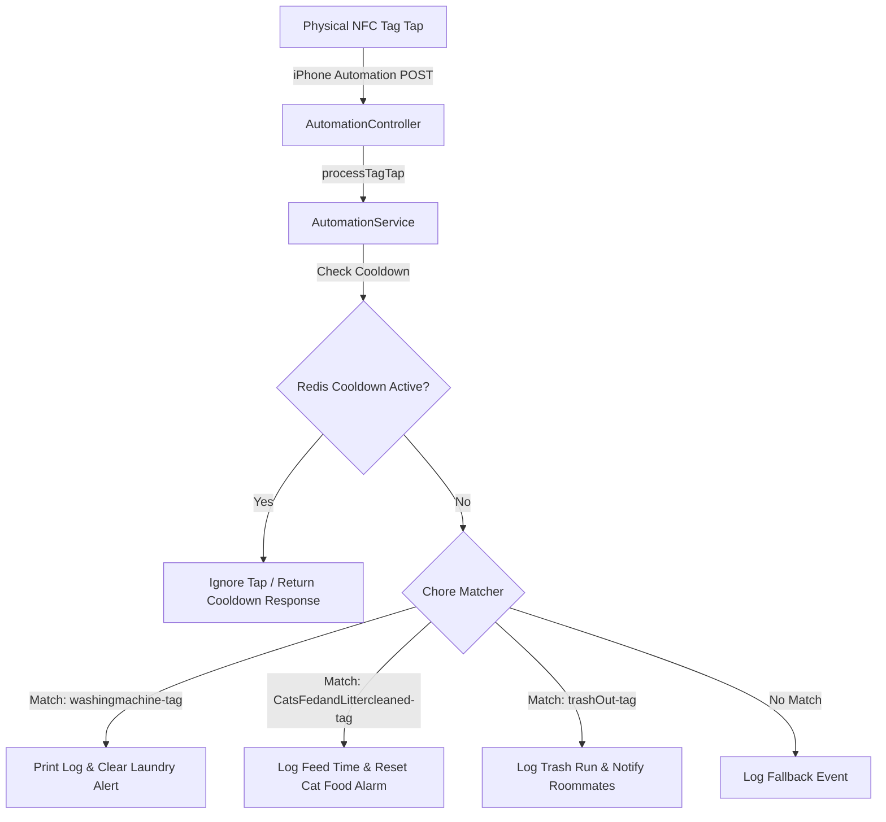
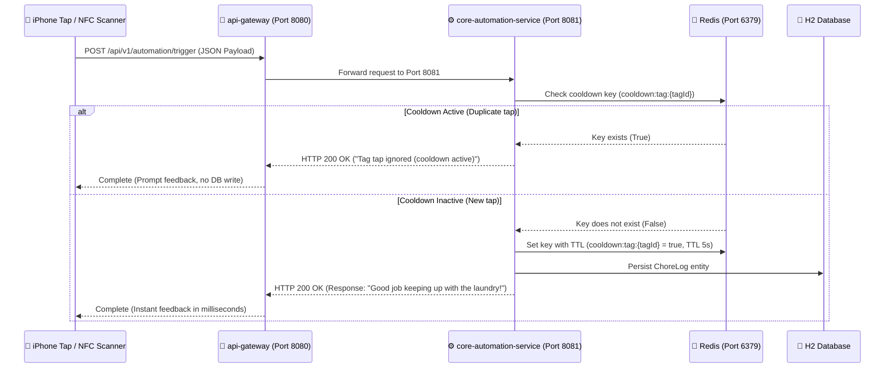
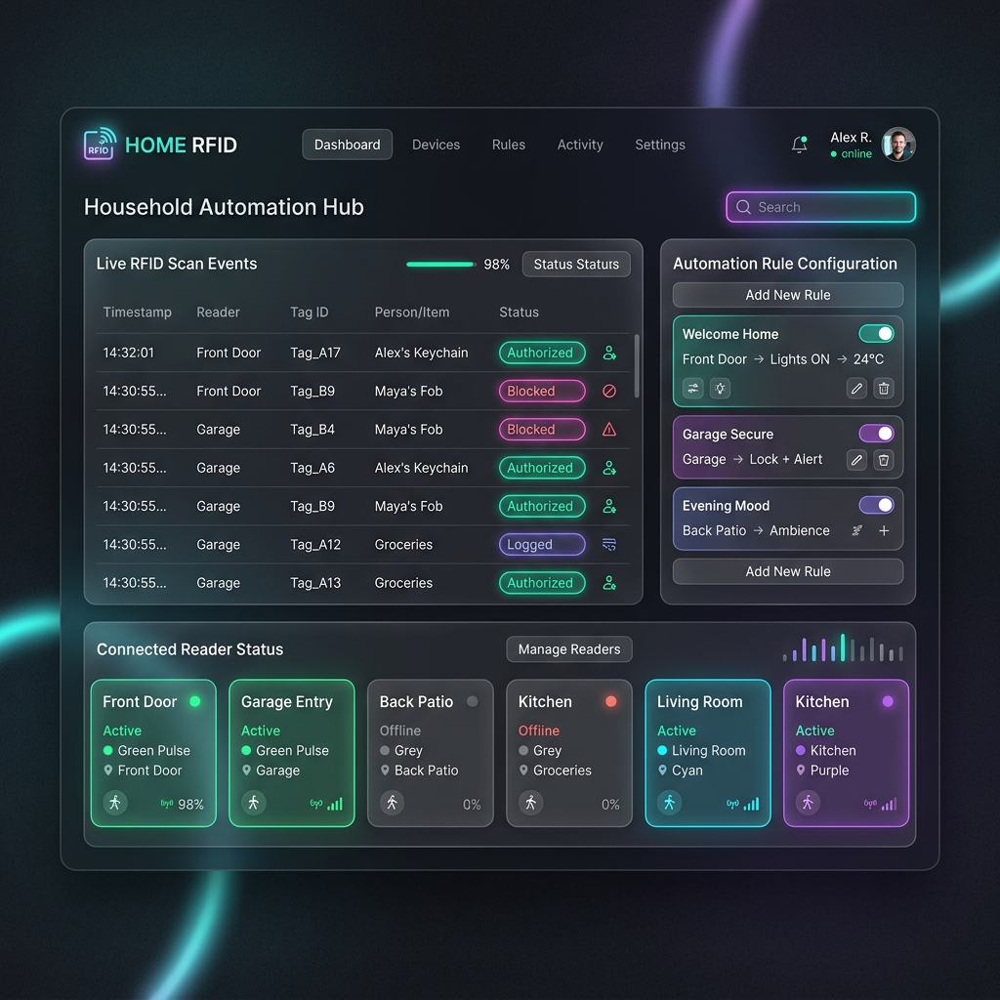

# 📡 Household Automation RFID Hub

A lightweight, robust Spring Boot service designed to bridge physical NFC/RFID tag events with local smart home actions. No more passive-aggressive fridge notes, no more chores forgotten. Just tap and let the system log it.

---

## 🎭 The Backstory: Surviving the Roommate Chore Wars

It started with a single sticky note on the microwave: *"Please clean your soup. - Management."* 

Then came the Great Laundry Stalemate of '25, where wet towels sat in the washing machine for three days like a damp, silent monument to roommate stubbornness. But the breaking point was the cats. Specifically, *Milo* and *Otis*. With three roommates on varying sleep schedules, the poor felines were either fed three times in a single morning (resulting in a couple of very fat, very happy cats) or not at all, leading to pre-dawn yowling and carpet scratching of apocalyptic proportions.

Trash duty? An exercise in structural physics, where garbage was piled up into a Jenga tower of milk cartons rather than anyone actually carrying it out to the bin.

Passive-aggression was at an all-time high. The Slack channel was a war zone. We needed a trustless, transparent, low-friction protocol for household chores. 

The solution? **Physical NFC Tags.**
We stuck NFC cards directly onto the washing machine, the cat food container, and the back door by the trash bins. Now, you don't send a text or write a note. You simply tap your phone against the physical card when you finish the chore. The event is fired instantly to our Spring Boot backend, logging the achievement, alerting the house, and keeping the peace.

---

## 🏗️ System Architecture

The workflow is simple: your client device (like an iPhone or esp32 scanner) detects a tag scan and pushes a POST request to our API endpoint. The backend uses Redis to debounce rapid duplicate taps (cooldown window) before running the chore matching logic.



## 🔄 Architectural Evolution: Monolith vs. Microservices

As our household automation needs expanded (and the chore wars intensified), we realized a single monolithic codebase was a bottleneck. Here is how the system evolved:

### Before (Monolithic Architecture)
Initially, the application was built as a single, unified monolith. 
* **All-in-One Engine**: A single running Spring Boot server handled routing endpoints, input validation, switch/conditional tag processing, and file/database logging in one project.
* **Bottlenecks**: If the third-party webhook API (e.g. sending a Discord or mobile alert) went down or ran slowly, it blocked the execution thread. The physical reader tap was delayed, or worse, the entire service crashed, rendering all chore logging offline.
* **Scaling**: We couldn't update or restart the notification handlers without taking down the tag scanners.

### After (Microservices Architecture with Redis)
To solve these limitations, we refactored the monolith into a distributed, decoupled microservice architecture, and integrated Redis to handle transient status caching and tag cooldown logic:

```text
                  +-----------------------------------+
                  |      📱 iOS Shortcut / Scanner    |
                  +-----------------+-----------------+
                                    |
                                    | HTTP POST (Port 8080)
                                    v
                  +-----------------+-----------------+
                  |         📡 API Gateway            |
                  |          (Port 8080)              |
                  +-----------------+-----------------+
                                    |
                                    | Route /api/v1/automation/**
                                    v
+-----------------------------------+-----------------------------------+
|                  ⚙️ core-automation-service                        |
|                           (Port 8081)                                 |
|                                                                       |
|   +-----------------------+              +-----------------------+    |
|   |   Tag Request Router  |              |    ChoreLog Entity    |    |
|   +-----------+-----------+              +-----------+-----------+    |
|               |                                      |                |
|               v                                      v                |
|   +-----------+-----------+              +-----------+-----------+    |
|   |  Conditional Engine   |              |    💾 H2 Database     |    |
|   +-----+-----------+-----+              +-----------------------+    |
|         |           ^                                                 |
+---------|-----------|-------------------------------------------------+
          |           |
          | Check     | Return Cooldown
          | Cooldown  | Status
          v           |
+---------------------+-----------------+
|             🔴 Redis                  |
|           (Port 6379)                 |
+---------------------------------------+
```

### Why Migrate?
1. **Separation of Concerns**: Each module has one distinct job. The `api-gateway` does routing, while the `core-automation-service` manages the chore logs and database operations.
2. **Single Responsibility**: The core automation module focus is entirely on processing tag inputs and persisting log details.
3. **Decoupled Gateway Routing**: Scanners interact exclusively with the gateway, meaning the core database and processing logic remain hidden behind port `8080`.
4. **Transient State & De-duplication (Redis)**: Integrating Redis allows us to enforce a "tap cooldown" (de-duplication/debounce) window. Physical NFC readers can trigger multiple requests during a single scan. By keeping track of active tag scans in Redis with short-lived TTLs, we prevent duplicate chore logs from hitting our persistent H2 database.

---

## 📂 Multi-Module Project Structure

The workspace is structured as a Maven multi-module project containing active modules:
* **[api-gateway](file:///Users/hude/spring/rfid%20-system/api-gateway)**: Built with Spring Cloud Gateway (running on port 8080) to route traffic from public endpoints to internal services.
* **[core-automation-service](file:///Users/hude/spring/rfid%20-system/core-automation-service)**: The main automation engine (running on port 8081) that handles tag taps, implements the conditional matching engine, and logs chore completions into the H2 Database.
* **`notification-service` (Decommissioned)**: Previously ran on port 8082; now decommissioned and removed from the active parent build reactor (`pom.xml`) to run as a database-only chore logger.

### System Communication Flow

To optimize network latency and handle chore completions instantly:



#### Separation of Concerns & Fast Processing
* **API Gateway Routing**: Acting as a single entry point, the gateway handles routing rules. Physical scanners and mobile shortcuts only target port `8080`, shielding internal ports (`8081`) and allowing centralized features like security checks, CORS headers, or rate-limiting.
* **NFC Debounce & Cooldown Check via Redis**: Before making a persistent database write, `core-automation-service` checks Redis to see if a tag cooldown is active. Redis serves as an extremely fast, low-latency in-memory cache to catch duplicate physical taps.
* **Direct Database Persistence**: If the tap is valid (not debounced), the `core-automation-service` writes the event to the in-memory H2 database and returns a success status back to the client device, keeping request resolution times extremely fast.

---

## 🛠️ Tech Stack

* **Language**: Java 21 (OpenJDK)
* **Framework**: Spring Boot (v3.2.5)
* **Web Services**: Spring Web (MVC), Spring Cloud Gateway
* **Data Layer**: 
  * Spring Data JPA with H2 (In-Memory Database)
  * Spring Data Redis (Cooldown caching & de-duplication)
* **Infrastructure**: Redis (Port 6379)
* **Mobile Client**: iOS Personal Automations (Shortcuts)

---

## 🎨 Final UI Dashboard Preview

Once fully integrated with a frontend client, the hub exposes real-time scan metrics, device online statuses, and automation toggles:



---

## 🧠 How to Implement the Logic on Your Own

To write the core automation business logic without rewriting the entire framework, you will be coding inside the service layer implementation ([AutomationServiceImpl.java](file:///Users/hude/spring/rfid%20-system/core-automation-service/src/main/java/com/house/automation/service/AutomationServiceImpl.java)). Here are the exact conceptual steps to implement the handler logic:

### 1. Data Extraction (Using Getters)
The method receives a [TagRequest](file:///Users/hude/spring/rfid%20-system/core-automation-service/src/main/java/com/house/automation/model/TagRequest.java) object containing request parameters.
* Extract the unique identifier of the scanned tag (`tagId`) using the appropriate model getter.
* Extract the name/device of the person who scanned it (`scannedBy`) using the scanned-by model getter.

### 2. Cooldown Window Check (Redis Integration)
To prevent accidental double-taps:
* Connect the Spring Boot backend to Redis using `StringRedisTemplate`.
* Check if a lock key (e.g., `"cooldown:tag:" + tagId`) exists in Redis.
* If the key **exists**, immediately return a cooldown message response (e.g., `"Cooldown active. Please wait before scanning again!"`).
* If the key **does not exist**, set the key in Redis with a value (like `"true"`) and set a short time-to-live expiration (e.g., 5 seconds).

### 3. The Conditional Engine
Create a comparison branch using conditional blocks (`if-else` or `switch` statements):
* Compare the extracted `tagId` against your set of known physical card IDs (e.g. `"washingmachine-tag"`, `"trashOut-tag"`, or `"CatsFedandLittercleaned-tag"`).
* **Security & Cleanliness Tip**: Always use safe string comparison (`"known-tag-id".equals(tagId)`) to avoid null pointer exceptions in case the scanned tag ID is null.

### 4. Event Logging & Persistent Storage
For each matched chore block:
* Construct a log message printing who swiped which tag (e.g. `[LOG] Roommate A swiped the WASHING MACHINE TAG!`).
* Use `System.out.println` or standard Spring logging (`org.slf4j.Logger`) to print the message.
* Instantiate a `ChoreLog` and call `choreLogRepository.save(choreLog)` to persist it to the database.

### 5. Feedback Loop Resolution
* Return a clear, human-readable confirmation string (e.g. `"Good job keeping up with the laundry, Roommate A!"`) representing the response.
* This string flows back through the [AutomationController](file:///Users/hude/spring/rfid%20-system/core-automation-service/src/main/java/com/house/automation/controller/AutomationController.java) to the scanner/phone, providing instant feedback.

---

## 📱 iOS Shortcut Configuration Blueprint

Use this blueprint to set up your iPhone to trigger chores automatically when you physically tap an NFC card:

1. **Open Shortcuts**: Launch the default **Shortcuts** app on your iPhone.
2. **Create Personal Automation**:
   - Go to the **Automation** tab (middle icon at the bottom).
   - Tap the **+** (plus icon) in the top right.
   - Search for and select **NFC** as the trigger.
3. **Scan the Tag**:
   - Tap **Scan** next to the NFC tag option.
   - Hold the top-back of your iPhone near your NFC card until it registers.
   - Name the tag (e.g., `WashingMachineCard`) and save.
   - Select **Run Immediately** (disable *Ask Before Running* & *Notify When Run* for a seamless zero-click experience).
   - Tap **Next**.
4. **Configure Action**:
   - Select **New Blank Automation**.
   - Tap **Add Action** and search for **Get Contents of URL**.
   - Set the URL input fields as follows:
     * **URL**: `http://<YOUR_SPRING_BOOT_SERVER_IP>:8080/api/v1/automation/trigger` *(Ensure your phone is on the same Wi-Fi network)*
     * **Method**: Change from `GET` to `POST`.
     * **Headers**: Add `Content-Type` with value `application/json`.
     * **Request Body**: Choose `JSON` and add two text keys:
       - `tagId` ➡️ `washingmachine-tag` (or whatever ID your service checks for)
       - `scannedBy` ➡️ `Your Name`
5. **Finish**: Tap **Done** in the top right. Go tap your tag!
