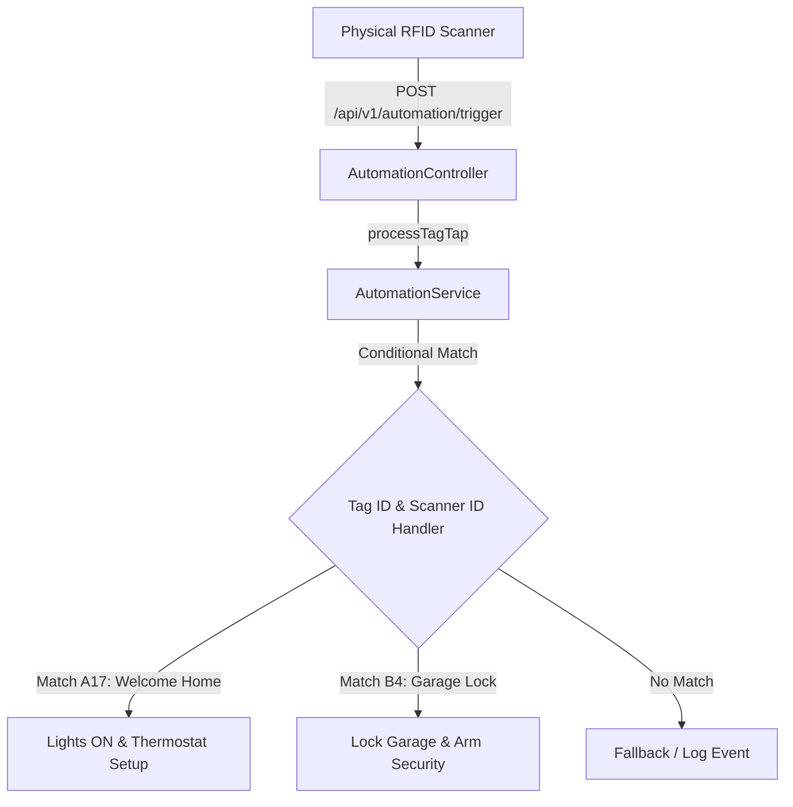

# Household Automation RFID Hub

A lightweight, high-performance Spring Boot service designed to integrate physical RFID/NFC scanners with a central household automation system. The hub processes real-time scan events and triggers custom smarthome scenes.

---

## 🏗️ System Architecture

The service sits between your physical RFID reader hardware (e.g., ESP8266/ESP32, Raspberry Pi, Arduino) and your home automation actuators.

### Key Components

1. **[AutomationController](file:///Users/hude/spring/rfid%20-system/src/main/java/com/house/automation/controller/AutomationController.java)**: Exposes the HTTP endpoint `/api/v1/automation/trigger` to ingest scan payloads asynchronously from network-enabled readers.
2. **[AutomationService](file:///Users/hude/spring/rfid%20-system/src/main/java/com/house/automation/service/AutomationService.java)**: Defines the core interface for tag processing. You will implement your custom conditional action matching within subclasses or service handlers here.
3. **[TagRequest](file:///Users/hude/spring/rfid%20-system/src/main/java/com/house/automation/model/TagRequest.java)**: A clean data-transfer-object representing the scan event payload:
   - `tagId`: The unique identifier read from the RFID tag.
   - `scannedBy`: The location or hardware identifier of the scanner (e.g., "Front Door", "Garage Entry").
4. **[AutomationApplication](file:///Users/hude/spring/rfid%20-system/src/main/java/com/house/automation/AutomationApplication.java)**: The main entry point to bootstrap and run the Spring Boot application.

---

## 🎨 Final UI Dashboard Preview

Once fully integrated, the household automation hub features a glassmorphic dashboard showcasing real-time scans, connected hardware states, and rules:

### Features in the Mockup:
* **Live RFID Scan Events**: Displays real-time lists of authorized and blocked entries with caller info.
* **Connected Reader Status**: Shows status logs, signal strengths, and battery telemetry for individual readers.
* **Automation Rule Configuration**: Toggle rules dynamically directly from the UI (e.g., toggling the "Welcome Home" scene).

---

## 🚀 Getting Started

1. **Implement Logic**: Open [AutomationService](file:///Users/hude/spring/rfid%20-system/src/main/java/com/house/automation/service/AutomationService.java) and implement a class to execute actions based on `TagRequest` attributes.
2. **Configure Actuators**: Add rest-template calls or MQTT integration to trigger external devices.
